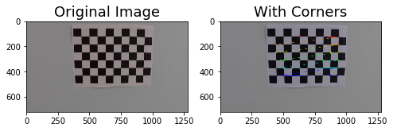
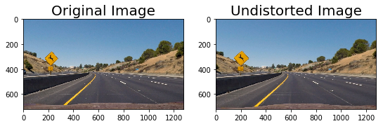
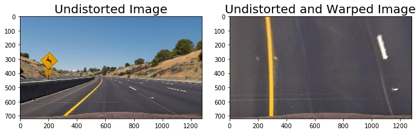
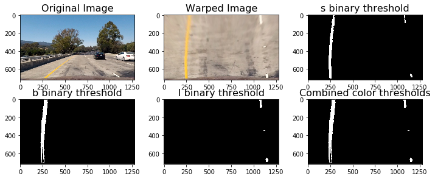
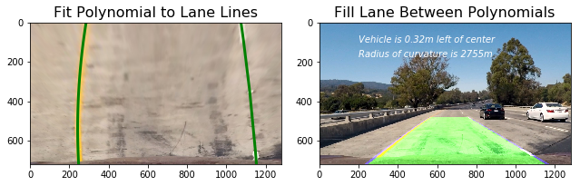

**Advanced Lane Finding Project**
### Camera Calibration

#### 1. Distortion Correction.

The first step in the project is to remove any distortion from the images by calculating the camera calibration matrix and distortion coefficients using a series of images of a chessboard.

First, I use `findChessboardCorners` and `drawChessboardCorners` to identify the locations of corners. The code for this step is contained in the second code cell of the IPython notebook located in "./mytry.ipynb".

Second, I use `calibrateCamera` to compute the camera calibration matrix and distortion coefficients, and use `undistort` to remove distortion from highway driving images. The code for this step is contained in the third code cell of the IPython notebook located in "./mytry.ipynb".

#### 2. Perspective Transform.

The second step in the project is to transform image to a "birds eye view" of the road which focuses only on the lane lines by using `getPerspectiveTransform` and `warpPerspective`. The source and destination points were selected manually. The code for this step is contained in the fifth code cell of the IPython notebook located in "./mytry.ipynb".

#### 3. Binary Thresholds.

The third step in the project is to convert the warped image to different color spaces and create binary thresholded images which highlight only the lane lines. I found that the combination of the following threshold does good job of highlighting: S Channel from the HLS color space between 180 and 255, L Channel from the LUV color space between 225 and 255, B channel from the Lab color space between 155 and 200. The code for this step is contained in the seventh code cell of the IPython notebook located in "./mytry.ipynb".

#### 4. Fitting a polynomial to the lane lines.

The fourth step is to fit a polynomial to each lane line. First, I find peaks in a histogram of the image. Second, I find all non zero pixels around histogram peaks. Third, I use `numpy.polyfit()` to fit a polynomial to each lane. The code for this step is contained in the nineth code cell of the IPython notebook located in "./mytry.ipynb".

#### 5. Calculating radius of curvature.

The fifth step is to calculate the radius of curvature. The final radius of curvature was taken by average the left and right curve radiuses. The code for this step is contained in the tenth code cell of the IPython notebook located in "./mytry.ipynb".

#### 6. Calculating vehicle position.

The sisth step is to calculate the position of the vehicle. First, I calculate `position = (rightx_int+leftx_int)/2`. Second, I calculate `distance_from_center = abs(image_width/2 - position)`. If the horizontal position of the car was greater than `image_width/2` than the car was considered to be left of center, otherwise right of center. Third, calculate the distance from center.  The code for this step is contained in the eleventh code cell of the IPython notebook located in "./mytry.ipynb".

#### 7. Output visual display.

Use above steps to output display.

### Pipeline

The code for pipeline is contained in 14, 15.

The final video result: challenge_result.mp4

### Discussion

I think it is difficult to find a single combination which produces the same quality result in any condition. When the lighting condition changed, or faded lane lines, may influence the result. It will be better to test the pipeline on additional video streams. 

